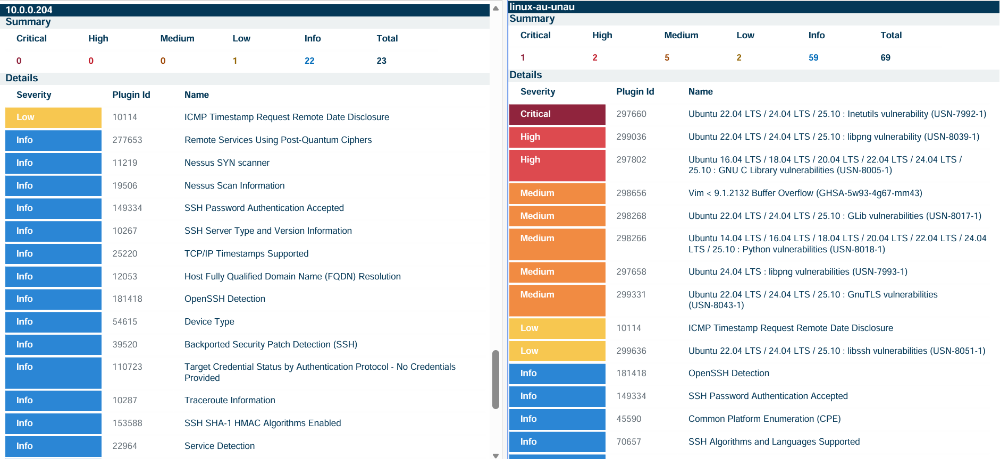

# Unauthenticated vs Authenticated Scan
In this lab, we compare the results of unauthenticated and authenticated scans taken in Linux OS.

## Setup

- **VM**: Linux (ubuntu 24.04)
- **Scanner**: Tenable Nessus

## Things we do

We are going to perform an unauthenticated and an authenticated scan on our Linux virtual machine with an internal scan server, which are both located in the same virtual network. Compare the reports generated after the scannings. 

## Difference

- **Unauthenticated Scans**: Vulnerability Management tools do not possess your admin credential. Only perform surface-level evaluation. Mainly focus on external facing vulnerability findings, which is what usually attackers see.
- **Authenticated Scans**: Scanners perform in-depth vulnerability scans with a provisioned admin credential, going through the OS configuration, file system, etc.

## Step
 
- **Start Scans**: Unauthenticated scan took 6 minutes, authenticated scan took 4 minutes.

## Final Report

