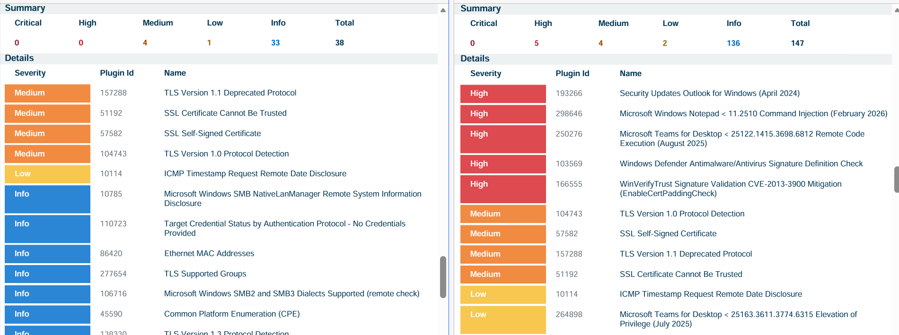

# Unauthenticated vs Authenticated Scan
In this lab, we compare the results of unauthenticated and authenticated scans taken in Win11 OS.

## Setup

- **VM**: win11-25h2-pro
- **Scanner**: Tenable Nessus

## Things we do

We are going to perform an unauthenticated and an authenticated scan on our Win11 virtual machine with an internal scan server, which are both located in the same virtual network. Compare the reports generated after the scannings. 

## Difference

- **Unauthenticated Scans**: Vulnerability Management tools do not possess your admin credential. Only perform surface-level evaluation. Mainly focus on external facing vulnerability findings, which is what usually attackers see.
- **Authenticated Scans**: Scanners perform in-depth vulnerability scans with a provisioned admin credential, going through the OS configuration, file system, etc.

## Step

- **Add firewall rule**: Since we are doing this lab in Azure environment, Azure provides NSG in the virtual network, we need to add a firewall rule which ensure the traffic between the scanner and the target. Allow all the in-bound traffic coming from IP 10.0.0.8 which is our internal Tenable Nessus server. 
- **Start Scans**: Unauthenticated scan took 10 mins, authenticated scan took 23 mins.

## Final Report

